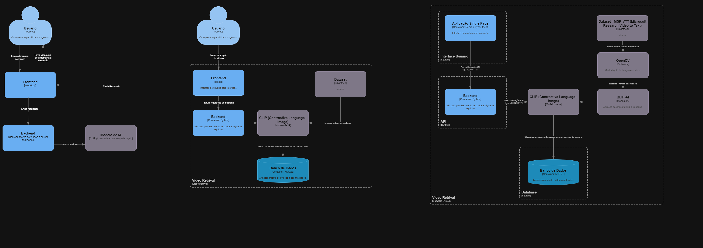

# Busca Multimodal em Vídeos: Localização de Conteúdos Baseada em Texto Descritivo
## Introdução
Este trabalho tem como objetivo o desenvolvimento de um sistema de busca multimodal
capaz de localizar segmentos de videos que correspondam a descriçoes textuais fornecidas
pelo usuario. O sistema utilizara modelos de aprendizado de maquina, como o BLIP juntamente com o CLIP,
para mapear texto e video em um espaço compartilhado, permitindo a analise de similaridade
semantica. O foco principal do trabalhado é de trazer ao usuario videos relacionados conforme a descrição
que fora descrita por ele além de trazer também a porcentagem de similaridade correspondente entre
a descrição e o conteudo do video.

## Dataset Escolhido:
MSR-VTT (Microsoft Research Video to Text) is a large-scale dataset for the open domain video captioning, which consists of 10,000 video clips from 20 categories,
and each video clip is annotated with 20 English sentences by Amazon Mechanical Turks. There are about 29,000 unique words in all captions. The standard splits uses 6,513 clips
for training, 497 clips for validation, and 2,990 clips for testing.

https://paperswithcode.com/dataset/msr-vtt

## Trabalhos Relacionados
### MSR-VTT: A Large Video Description Dataset for Bridging Video and Language
Jun Xu , Tao Mei , Ting Yao and Yong Rui
Microsoft Research, Beijing, China
{v-junfu, tmei, tiyao, yongrui}@microsoft.com

### Multimodal video retrieval with CLIP: a user study
Tayfun Alpay1 · Sven Magg1 · Philipp Broze2 · Daniel Speck1
Received: 20 May 2023 / Accepted: 12 September 2023 / Published online: 29 September 2023
© The Author(s) 2023

### X-CLIP: End-to-End Multi-grained Contrastive Learning for Video-Text Retrieval
Yiwei Ma1∗, Guohai Xu3, Xiaoshuai Sun12†, Ming Yan3, Ji Zhang3, Rongrong Ji12
1Media Analytics and Computing Lab, Department of Artificial Intelligence, School of Informatics,
Xiamen University, 361005, China, 2Institute of Artificial Intelligence,
Xiamen University, 3DAMO Academy, Alibaba Group.

## Fluxo de entrada
- Entrada: Usuario insere a descrição sobre algum video que ele deseja.
- Manipulação: A descrição é pega pela API e enviada a IA para fazer a comparação.
- Embeddings: Usamos o data MSR-VTT para gerar os embeddings onde, com a ajuda do OpenCV para gerar os frames a partir dos videos,
  do BLIP (Bootstrapping Language-Image Pre-training for Unified Vision-Language Understanding and Generation) para gerar as descrições atraves dos frames e
  por fim o uso do CLIP para gerar os embeddings visuais.
- Similaridade e Classificação: Calculada atraves dos embeddings visuais e comparadas com a descrição do usuario para no final serem classificação atraves
  de um valor porcentual de aproximação entre os embeddings e descrição.
- Saida: Uma lista de videos relacionados a partir da descrição feita pelo usuario.

## Tecnologias Utilizadas
- Python
- OpenCV
- BLIP
- CLIP
- FASTAPI

## C4 Model

## Solução Proposta
Nossa solução sobre a proposta se deu a partir da criação de uma API sendo consumida por um frontend, onde disponibilizaria ao usuario um input para inserir a descrição dos videos que ele gostaria que fossem trazidos a ele.

Usamos o dataset MSR-VTT para "povoar" nossa base de dados, ele é um dataset multimodal porém nos nao conseguimos achar o arquivo que continha as descrições dos videos então tivemos que fazer a descrição dos videos usando uma ferramenta chamada BLIP (Bootstrapping Language-Image Pre-training). Ela gera descrições a partir de imagens, portanto, nos tivemos que usar o OpenCV para extrair os frames dos videos para que assim o BLIP utilizasse esses frames e então fizesse as descrições.

Com as descrições realizadas, usamos o CLIP para gerar os embeddings visuais e textuais, comparando com as descrições criadas pelo BLIP e assim gerando a similirade da descrição feita pelo usuario, com a descrição de cada video e assim levando ao usuario os videos relacionados juntamente com a porcentagem dessa similaridade.
